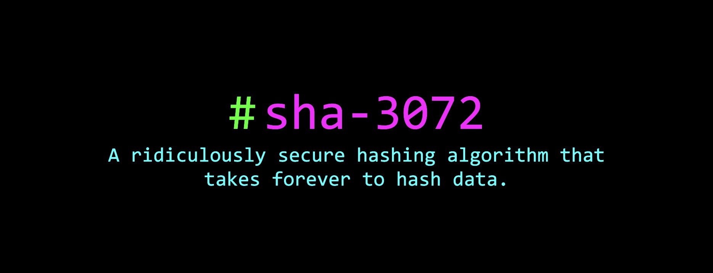

<div align="center">
  <a href="#">
    
  </a>
</div>

## Table of Contents
1. [Introduction](#introduction)
2. [Features](#features)
3. [Dependencies](#dependencies)
4. [Installation](#installation)
5. [Usage](#usage)
6. [How It Works](#how-it-works)
7. [License](#license)

## Introduction
**sha-3072** is a ridiculously complicated hashing algorithm designed for extreme complexity and security.

This tool goes beyond traditional hashing functions like SHA-256 by integrating multi-dimensional transformations, entropy analysis and sponge construction.

## Features
- **Deterministic**: Produces the same hash for identical inputs.
- **Quantum Resistance**: Implements lattice transformations for enhanced security.
- **Dynamic**: Incorporates entropy-based round keys to add variability.
- **Multi-Dimensional Hashing**: Uses an 8D matrix to process and encode data.
- **Verbose Mode**: Detailed logs of every step when using the `-v` flag.
- **Compact Output**: Generates a 3072-bit (384-byte) hexadecimal hash.

## Dependencies
- Python 3.8 or higher
- NumPy

## Installation
1. Clone the repository:
   ```bash
   git clone https://www.github.com/RekuNote/sha-3072.git
   cd sha-3072
   ```

2. Install dependencies:
   ```bash
   python3 -m pip install numpy
   ```

3. Run the script:
   ```bash
   python3 sha3072.py
   ```

## Usage
The tool provides a simple interface with flexible arguments.
> **Note:** This tool may take a long time to hash data depending on your specific hardware specification

### Syntax
```bash
python3 sha3072.py [OPTIONS] <INPUT>
```

### Arguments
1. **Plaintext Input**:
   Hash a string directly by using the `-p` flag:
   ```bash
   python3 sha3072.py -p "your input here"
   ```

2. **File Input**:
   Hash the contents of a file by providing its path:
   ```bash
   python3 sha3072.py <file_path>
   ```

3. **Verbose Mode**:
   Add the `-v` flag to see detailed logs of the hashing process:
   ```bash
   python3 sha3072.py -p "your input here" -v
   ```

### Examples
1. **Hash a String**:
   ```bash
   python3 sha3072.py -p "hello world"
   ```

2. **Hash a File**:
   ```bash
   python3 sha3072.py /path/to/file.txt
   ```

3. **Verbose Logging**:
   ```bash
   python3 sha3072.py -p "verbose test" -v
   ```

## How It Works

sha-3072 operates in multiple intricate stages, described below:

1. **8D Matrix Initialization**:
   - A pseudo-random 8-dimensional matrix is created, seeded deterministically by the input data. This ensures the matrix is consistent across identical inputs.

2. **Data Injection**:
   - The input data is loaded into the 8D matrix. Each byte of data influences multiple points in the matrix, creating a distributed impact.

3. **Chaos-Based Transformations**:
   - The matrix undergoes 256 iterative transformations. Each transformation applies sine-based chaotic alterations, ensuring non-linear diffusion of data across dimensions.

4. **Entropy-Based Dynamic Round Keys**:
   - Shannon entropy is calculated from the input data. This entropy generates dynamic keys, which are XORed into the matrix to further obfuscate the internal state.

5. **Lattice-Based Diffusion**:
   - A quantum-resistant lattice transformation is applied to every element in the matrix, ensuring advanced security against modern cryptographic attacks.

6. **Pseudo-Infinite Random Walk**:
   - The matrix undergoes 512 random walk steps, where values are altered based on pseudo-randomly selected indices, ensuring non-reversibility.

7. **Matrix Flattening**:
   - The 8D matrix is folded into a 1D array for compression, with each element retaining its heavily transformed state.

8. **Sponge Construction**:
   - The flattened array undergoes a final compression using sponge construction. SHA-3-512 is used iteratively to generate a precise 3072-bit hash.

## License

This project is licensed under the Creative Commons Attribution-NonCommercial 4.0 International License (CC BY-NC 4.0). You are free to:

- Share — copy and redistribute the material in any medium or format
- Adapt — remix, transform, and build upon the material

Under the following terms:

- **Attribution** — You must give appropriate credit, provide a link to the license, and indicate if changes were made. You may do so in any reasonable manner, but not in any way that suggests the licensor endorses you or your use.
- **NonCommercial** — You may not use the material for commercial purposes.

For more details, please see the full license at [Creative Commons](https://creativecommons.org/licenses/by-nc/4.0/).
